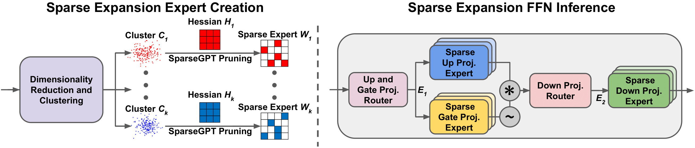
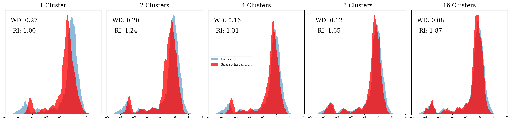

# Sparse Expansion
Here we include the code for our paper [Sparse Expansion and Neuronal Disentanglement](https://arxiv.org/abs/2405.15756). The code allows for the creation and evaluation of Sparse Expansion models in terms of overall perplexity.


*One-shot expert creation process and inference process of Sparse Expansion in an FFN block.*

## Requirements
* python==3.10
* cuda==11.8
* torch==2.2.2
* transformers==4.40.2
* cudf-cu11==23.12.*
* cuml-cu11==23.12.*
* datasets

Notably, cuML seems to perform most stably on CUDA 11, so we used the cuML packages for that version.

## Installation
We use Micromamba to create our environment, see here: [Micromamba](https://mamba.readthedocs.io/en/latest/installation/micromamba-installation.html).
```
git clone https://github.com/Shavit-Lab/Sparse-Expansion.git
cd Sparse-Expansion
micromamba create -n sparse-expansion python=3.10
micromamba activate sparse-expansion
pip install -r requirements.txt
pip install -e .
```


## Example Usage
To evaluate the performance of Sparse Expansion models in terms of perplexity, the following command can be run:
```
python main.py \
  --model [pythia or llama] \
  --model_size [supports all Pythia model sizes and Llama 2 7B and 13B as well as Llama 3 8B] \
  --cache_dir [cache directory for the model, tokenizer, and dataset] \
  --sparsity [sparsity expressed as a float, or in N:M format as a tuple (N, M)] \
  --quantize [if flag is set, quantize] \
  --bits [number of bits to quantize to if quantize flag is set, otherwise ignored] \
  --verbose [if flag is set, show more detailed progress] \
  --dataset [wikitext2 or c4, c4 is sometimes down so experiments were all conducted on wikitext2] \
  --dataset-size [number of calibration samples] \
  --no_PCA [if flag is set, do not perform PCA] \
  --PCA_reduction_factor [degree of dimensionality reduction if no_PCA is not set, otherwise ignored] \
  --num_clusters [number of clusters]
```
For example, here is a command to evaluate a 50% sparse Pythia 12B model with 16 experts and no additional quantization: 
```
python main.py --model pythia --model_size 12B --sparsity 0.5 --dataset wikitext2 --dataset-size 128 --num_clusters 16 --PCA_reduction_factor 32
```
As another example, here is a command to evaluate a 2:4 sparse Llama 2 7B model with 16 experts and 4 bit quantization: 
```
python main.py --model llama --model_size 7B --sparsity (2, 4) --quantize --bits 4 --dataset wikitext2 --dataset-size 128 --num_clusters 16 --PCA_reduction_factor 32
```
## Neuronal Disentanglement

*Modeling recovery with more experts in a neuron from Pythia 1.4B. The sparse computation output distribution (red) matches the dense one (blue) better with more clusters. Sparsity is set to 90\% for each expert. WD represents the Wasserstein distance between the sparse output distribution and the dense distribution. RI represents relative improvement of Sparse Expansion ($`n \geq 1`$ clusters) over baseline SparseGPT ($`n = 1`$ cluster).*

## Cite
If you found our work useful, please cite our paper:
```
@article{sawmya2024sparse,
  title={Sparse Expansion and Neuronal Disentanglement},
  author={Sawmya, Shashata and Kong, Linghao and Markov, Ilia and Alistarh, Dan and Shavit, Nir},
  journal={arXiv preprint arXiv:2405.15756},
  year={2024}
}
```
